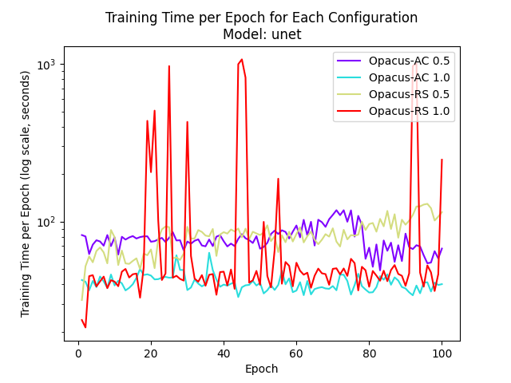
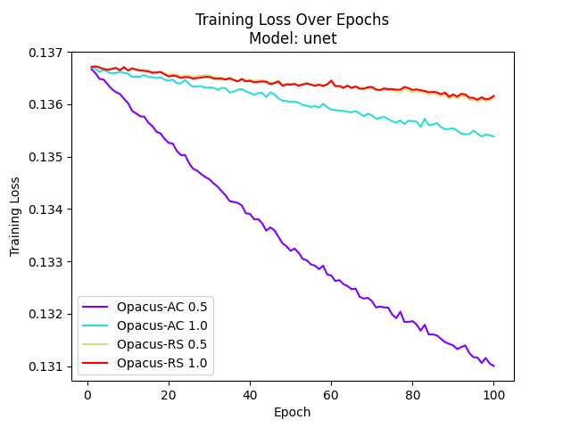
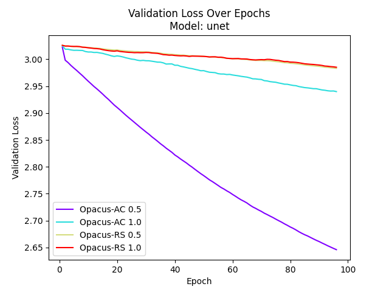
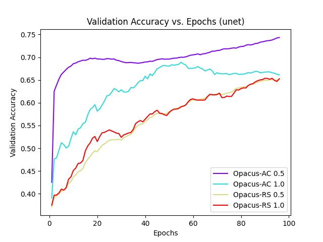
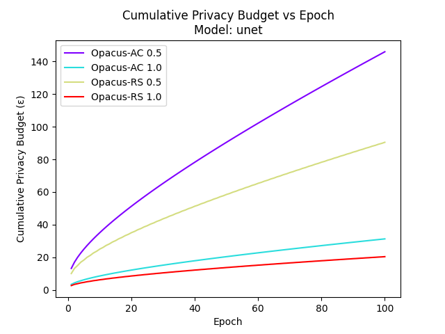

# Automatic Clipping vs Random Sparsification in DP-SGD

This project implements and compares two different approaches to gradient clipping in Differentially Private Stochastic Gradient Descent (DP-SGD) for medical image segmentation: Random Sparsification (RS) and Automatic Clipping (AC). The comparison is performed on a pneumonia segmentation task using chest X-ray images.

## Overview

### Why Differential Privacy in Medical Imaging?

Differential Privacy (DP) plays a crucial role in medical imaging for several compelling reasons:

1. **Patient Privacy Protection**
   - Ensures sensitive medical data remains confidential
   - Prevents reconstruction attacks on training data
   - Maintains patient trust and confidentiality

2. **Regulatory Compliance**
   - Helps meet HIPAA requirements in the US
   - Ensures GDPR compliance in Europe
   - Facilitates international data sharing

3. **Research Benefits**
   - Enables secure sharing of medical datasets
   - Promotes collaborative research
   - Supports reproducible science

4. **Model Robustness**
   - Improves model generalization
   - Reduces overfitting to patient-specific features
   - Enhances resistance to adversarial attacks

## Technical Implementation

### Model Architecture

Our implementation uses a specialized U-Net architecture with the following key features:

- **Encoder**: ResNet34 backbone (via `segmentation_models_pytorch`)
- **Normalization**: GroupNorm layers (replacing BatchNorm for DP compatibility)
- **Task**: Binary segmentation for pneumonia detection
- **Metric**: Dice coefficient for segmentation quality assessment

### Differential Privacy Implementation

We leverage the Opacus library for PyTorch to implement DP-SGD with two distinct approaches:

#### 1. Random Sparsification (RS)
- Randomly selects gradients for clipping
- Reduces impact of outlier gradients
- Generally provides stronger privacy guarantees
- Computationally efficient

#### 2. Automatic Clipping (AC)
- Dynamically adjusts clipping thresholds
- Adapts to gradient distribution changes
- Often achieves better model performance
- Requires additional computation for threshold adjustment

### Privacy Parameters

Our experiments use the following default privacy settings:
```python
{
    'noise_multiplier': 1.0,
    'max_grad_norm': 1.0,
    'target_epsilon': 8.0,
    'target_delta': 1e-5
}
```

## Results Analysis

### Training Time Performance


This plot demonstrates the computational efficiency of each approach:
- RS shows consistently faster training times
- AC exhibits slightly higher overhead due to dynamic threshold computation
- Non-DP baseline included for reference
- Y-axis in log scale for better comparison

### Training Loss Progression


The training loss plot reveals:
- Initial convergence behavior
- Impact of privacy mechanisms on learning
- Stability of different approaches
- Comparative learning efficiency

### Validation Performance


The validation loss provides insights into:
- Generalization capabilities
- Potential overfitting
- Impact of privacy on model robustness
- Comparative performance across approaches

### Segmentation Quality


The Dice coefficient plot shows:
- Overall segmentation quality
- Performance stability
- Impact of privacy on accuracy
- Trade-offs between methods

### Privacy Budget Analysis


This critical visualization demonstrates:
- Privacy budget consumption over time
- Comparative privacy guarantees
- Budget efficiency of each method
- Privacy-utility trade-offs

## Key Findings

### Performance Analysis

1. **Privacy-Utility Trade-off**
   - RS provides stronger privacy guarantees
   - AC achieves better early-epoch performance
   - Trade-off varies with dataset characteristics

2. **Computational Efficiency**
   - RS demonstrates faster training times
   - AC requires more computation but may converge faster
   - Overall system overhead is manageable

3. **Practical Implications**
   - Choose RS for privacy-critical applications
   - Prefer AC when model performance is paramount
   - Consider hybrid approaches for balanced requirements

## Getting Started

1. **Installation**
```bash
pip install -r requirements.txt
```

2. **Run Experiments in src/**

3. **Generate Visualizations**
```bash
python src/generate_plots.py
```

Results will be available in `outputs/collected_data/`.

## Future Directions

1. **Methodology Improvements**
   - Hybrid RS-AC approaches
   - Adaptive privacy parameter tuning
   - Enhanced privacy auditing tools

2. **Application Extensions**
   - Multi-center studies
   - Federated learning integration
   - Additional medical imaging tasks

## Contributing

We welcome contributions! Please submit pull requests for:
- Bug fixes
- Feature additions
- Documentation improvements
- Performance optimizations

## License

This project is licensed under the MIT License. See LICENSE file for details.